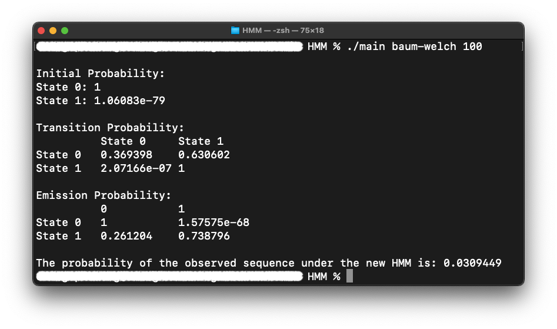

# Hidden Markov Model

- A simple HMM example was used in this project to implement algorithms of HMM
- I made this little project for educational purpose while being a TA in Genome Informatics [CSIE5014] at NCKU, Fall 2022

## Algorithms Implemented

- Viterbi Algorithm
- Forward Algorithm
- Forward-Backward Algorithm
- Baum-Welch Algorithm
- Scaled Baum-Welch Algorithm<br>// Scaling is a technique for dealing with underflow issue, which could be encountered if the observed sequence is too long

## Example Used in this Project

<p align=center>
    
</p>

- $Observed\ sequence:$ `0011110` 
- $Initial\ probability:$
  - $\pi_0: 0.5$
  - $\pi_1: 0.5$
- $Transition\ probability:$
  - $The\ probability\ of\ state\ 0\ to\ state\ 0: 0.8$
  - $The\ probability\ of\ state\ 0\ to\ state\ 1: 0.2$
  - $The\ probability\ of\ state\ 1\ to\ state\ 0: 0.2$
  - $The\ probability\ of\ state\ 1\ to\ state\ 1: 0.8$
- $Emission\ probability:$
  - $The\ probability\ that\ state\ 0\ emits$ `0`: $0.9$
  - $The\ probability\ that\ state\ 0\ emits$ `1`: $0.1$
  - $The\ probability\ that\ state\ 1\ emits$ `0`: $0.2$
  - $The\ probability\ that\ state\ 1\ emits$ `1`: $0.8$

## Getting Started

Compile the program with the following command:

```cmd
g++ *.cpp src/*.cpp -std=c++17 -o main
```

Run `main` with the following commnad (for macOS user):

```cmd
./main [algorithm] [iteration]
```

| Option | Description |
| --- | --- |
| `[algorithm]` | `forward`: run forward algorithm <br>`forward-backward`: run forward-backward algorithm <br>`baum-welch`: run Baum-Welch algorithm<br>`scaling`: run scaled Baum-Welch algorithm<br>`viterbi`: run Viterbi algorithm    |
| `[iteration]` | How many iterations to run.<br>Only required for `baum-welch` & `scaling`.|

For example, the following command runs Baum-Welch algorithm for 100 iterations:

```cmd
./main baum-welch 100
```

The following command runs Viterbi algorithm:

```cmd
./main viterbi
```

## Output

### Viterbi

<p align=center>
    
</p>

### Forward

<p align=center>
    
</p>

### Forward-Backward

<p align=center>
    
</p>

### Baum-Welch

<p align=center>
    
</p>

### Scaled Baum-Welch

<p align=center>
    
</p>